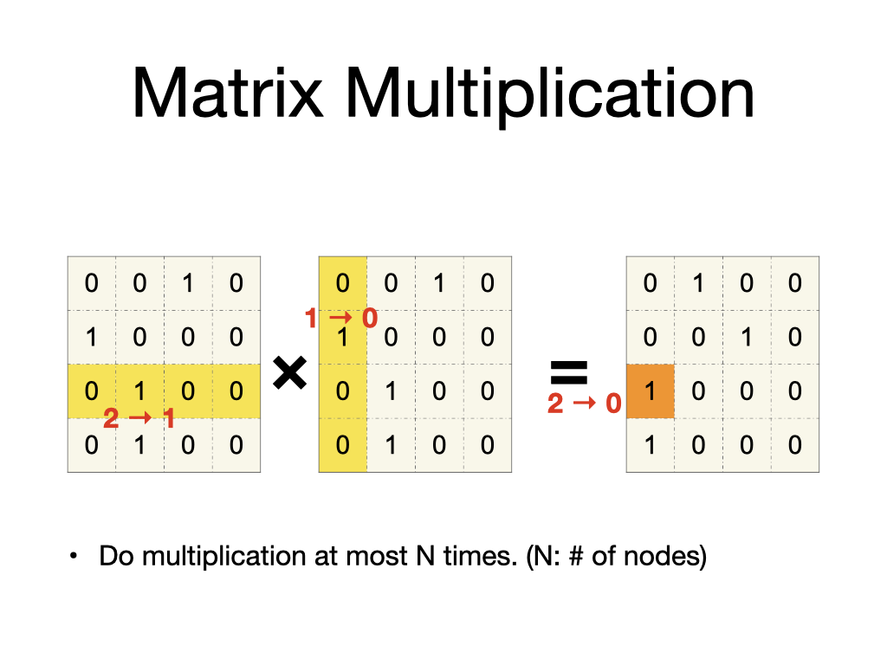

# Homework 1: Cycle Detection

## Purpose:

Detect if a directed graph contains cycle by linear algebra addition and multiplication.

## Summary:

### Problem 1
If directed graph represents by a sparse matrix, and **each edge is represented by filling the starting point with -1 and ending point with 1, others with 0**. How to detect if the directed graph contains a cycle?

### Explanation
Because each row is an edge, adding one row to other row means connecting the one edge to the other. If we get ALL 0 row, then the graph has a cycle.

  1. Start from connecting the first edge to all edge connected to first edge
  2. Append the result to the matrix. 
  3. Remove first row because it's connected to other edge.
  4. So on and so forth until there is only one edge left or ALL 0 row is detected

### Solution
  1. Table 1 represents Graph 1. We take 1st edge and find all edges connected to it which means those rows have value -1 on column 2.
  2. Table 2 is appended two additions from 1st row to 2nd row and 1st row to 4th row from Table 1. Graph 2 shows that first row is removed and merged to 2 -> 0 and 2 -> 3 edges.
  3. Table 3 do the same operations, and Graph 3 has a new edge 1 -> 2, and first row is removed.
  4. After addition from 1st edge and 3rd edge from Table 3, there would be a ALL 0 row. A cycle is detected.

### Problem 2
If directed graph represents by a sparse matrix, and **an edge from node i to j is represented by filling 1 in (i, j), others with 0**. How to detect if the directed graph contains a cycle?

### Explanation

Because each entry on (i, j) is an edge from node i to node j, multiply entry on (j, k) would yield a result on (i, k), which means there is a edge from i to k. If we get ANY value greater than 0 on diagonal, then the graph has a cycle.

  1. Multiply matrix on matrix to get the new matrix, the new matrix indicates steping every edge to the one connected to it.
  2. Multiplying matrix to the new matrix again indicates step antoher one step further.
  3. So on and so forth at most number of nodes times or any value on diagonal greater than 0.

### Solution
  1. Table 1 represents Graph 1. We multiply Table 1 by Table 1, and get the result of Table 2. It means connecting edge to the next edge as indicated in Graph 2.
  2. Then Graph 2 multiplies Graph 1, and get the result of Table 3. Multiply Graph 1 instead of Graph 2 is that Graph 1 shows the original edge of node while Graph 2 shows shortcuts of edges.
  3. There are value 1s on diagonal. A cycle is detected.

## Reference

- [Homework explaination powerpoint](https://docs.google.com/presentation/d/1v8bATvrXwYLJzYry3bo29kKJEjEj52uW7PO6ejOOr0g/edit#slide=id.p1)